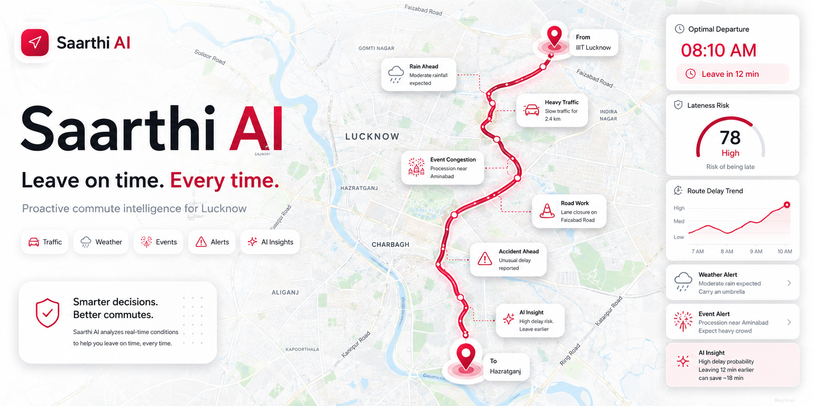

<div align="center">

# Saarthi AI

## Stop Guessing When to Leave.

### Saarthi AI is a proactive commute-planning agent for Lucknow, India.

**Saarthi does not just answer traffic questions. It plans when you should leave, explains why, remembers what happened before, and uses MongoDB MCP to reason over your commute history.**

[](#built-for-the-google-cloud-rapid-agent-hackathon)
[](#mongodb-partner-track-integration)
[](https://urmilasaini-saarthiai.hf.space/)
[](https://github.com/parthmax2/saarthi-ai)
[](#quality-proof)

## Built for the Google Cloud Rapid Agent Hackathon

### MongoDB Partner Track

### Why judges should stop here

| What Saarthi does | Why it matters |
|---|---|
| Simulates future departure windows | It predicts when leaving late becomes risky, not just traffic right now |
| Uses MongoDB as agent memory | Commute history becomes queryable context for future answers |
| Connects to MongoDB MCP | The agent can inspect real stored commute data with MCP tools |
| Blends traffic, weather, events, festivals, and advisories | It understands local Lucknow commute risk beyond maps |
| Streams visible tool progress | Judges can see the agent working instead of trusting hidden magic |

</div>



---

## Problem Statement

In Indian cities, "traffic time" is not just traffic. A commute can be delayed by rain, religious events, processions, school rush, railway-station congestion, public gatherings, and sudden police diversions. In Lucknow, this is especially visible around Hazratganj, Charbagh, Gomti Nagar, Old Lucknow, and Ekana Stadium.

Most navigation apps are reactive:

- They tell you what the road looks like right now.
- They do not simulate multiple future departure windows.
- They rarely understand local event patterns like Bada Mangal bhandaras or Muharram processions.
- They do not remember your past commutes.
- They do not let you ask, "Based on my previous trips, which day is worst for this route?"

The real user problem is not "What is the route?" The real problem is:

> "When should I leave so I do not get late, and what hidden local factors should I worry about?"

Saarthi tackles that problem as an agent, not a static chatbot.

---

## How We Tackled It Smartly

Saarthi breaks the commute decision into small, verifiable actions:

1. **Predict future traffic, not just current traffic**  
   Saarthi uses TomTom's `departAt` routing to simulate multiple future departure times and build an ETA curve. Instead of saying "28 minutes now," it can say "leave by 8:10 AM; leaving at 8:30 AM crosses the risk threshold."

2. **Fuse local risk signals in parallel**  
   It checks traffic, weather, festivals, public events, and police advisories at the same time. This keeps the response fast while still capturing the messy real-world causes of delay.

3. **Use a deterministic risk score before LLM narration**  
   The 0-100 risk score is computed from auditable factors: traffic delay, rain, festivals, events, and advisories. Gemini explains the result, but the risk math is not hidden inside the model.

4. **Use MongoDB as memory, not just storage**  
   Every planned commute is stored in MongoDB Atlas. Saarthi can later answer questions about route patterns, worst days, typical delays, and historical commute behavior.

5. **Use MongoDB MCP as the partner superpower**  
   Ask Saarthi connects to the MongoDB MCP server so the agent can inspect and query stored commute history with MongoDB tools such as `find`, `aggregate`, and `list-collections`.

6. **Degrade safely when live services fail**  
   External APIs can rate-limit or fail. Saarthi uses caching, fallback LLM providers, deterministic fallback summaries, and clean SSE error messages so the app stays demo-safe.

---

## Why This Is More Than a Chatbot

| Basic chatbot | Saarthi AI agent |
|---|---|
| Answers a question from text | Calls tools, gathers data, and builds a decision |
| Reacts to the user's prompt | Simulates future departure windows |
| No durable memory | Stores commute outcomes in MongoDB Atlas |
| No partner system integration | Uses MongoDB MCP tools over real stored commute data |
| Hard to verify | Risk score, tool events, tests, and smoke checks are visible |

---

## Core User Flow

1. User enters origin, destination, arrival deadline, and mode.
2. Saarthi geocodes the places within Lucknow.
3. It simulates multiple departure times using TomTom `departAt`.
4. It checks rain forecast, festivals, public events, and police advisories.
5. It computes a deterministic risk score.
6. Gemini synthesizes the final verdict.
7. The result is saved to MongoDB `commute_history`.
8. The user can ask follow-up questions in Ask Saarthi.
9. Ask Saarthi can use MongoDB MCP to query historical commute patterns.

---

## MongoDB Partner Track Integration

Saarthi uses MongoDB in three meaningful ways:

| MongoDB feature | How Saarthi uses it |
|---|---|
| MongoDB Atlas | Stores commute history and API cache data |
| TTL collection | Auto-expires cached API responses to avoid stale data and paid API overuse |
| MongoDB MCP Server | Gives the chat agent direct tool access to commute-history collections |

### Collections

- `api_cache`  
  Stores API responses with TTL expiry, reducing repeated calls to traffic/event services.

- `commute_history`  
  Stores route, ETA, delay, risk score, weather summary, festival names, event count, advisory count, and timestamps.

### MCP Tools Verified

The strict MCP smoke test verifies that the MongoDB MCP server starts and exposes:

- `find`
- `aggregate`
- `list-collections`

This proves the partner integration is not decorative. It is testable and required for the agent's memory-driven answers.

---

## Demo Script for Judges

### Demo 1: Proactive departure planning

Use:

- From: `Gomti Nagar`
- To: `Hazratganj`
- Arrive by: `9:30 AM`
- Mode: `car`

What to show:

- ETA curve across future departure times
- Risk score
- Recommended leave-by time
- Local festival/weather/event factors
- Route visualization and live SSE progress

### Demo 2: Local intelligence

Ask:

```text
Any festival tomorrow near Hazratganj?
```

What to show:

- The agent checks local festival context.
- It explains the commute relevance, not just the festival name.

### Demo 3: MongoDB memory

After running a few plans, ask:

```text
Which day is worst for my Charbagh commute?
```

What to show:

- The agent uses stored commute history.
- MongoDB MCP tools can inspect/query the history collection.
- The answer is based on real saved results, not invented memory.

---

## Architecture

```text
User request
   |
   v
FastAPI + SSE stream
   |
   +-- Geocoding: TomTom + Geoapify
   +-- Traffic sweep: TomTom departAt future simulations
   +-- Weather: Open-Meteo
   +-- Festivals: Calendarific + curated Lucknow calendar
   +-- Events: Ticketmaster
   +-- Advisories: DuckDuckGo public advisory search
   |
   v
Deterministic risk formula
   |
   v
Gemini synthesis through Google ADK
   |
   v
MongoDB Atlas persistence
   |
   v
Ask Saarthi chat agent
   |
   +-- Python route/weather/festival/history tools
   +-- MongoDB MCP Server: find, aggregate, list-collections
```

---

## Tech Stack

| Layer | Technology |
|---|---|
| Agent orchestration | Google ADK `LlmAgent` + `InMemoryRunner` |
| LLM | Gemini model chain, configurable via `GEMINI_MODELS`; Groq fallback |
| Partner track | MongoDB Atlas + MongoDB MCP Server |
| Backend | FastAPI, Server-Sent Events, Python 3.11 |
| Frontend | Jinja2, vanilla JavaScript, Leaflet, OpenStreetMap |
| Traffic | TomTom Routing API with `departAt` sweep |
| Weather | Open-Meteo |
| Events | Calendarific, Ticketmaster, curated Lucknow calendar |
| Deployment | Hugging Face Spaces Docker |

> If a hackathon requires a specific Gemini 3 model, set it in `.env` with `GEMINI_MODELS=<required-model-id>`.

---

## Quality Proof

### Unit tests

```bash
python -m pytest tests -q
```

Current result:

```text
121 passed
```

### MCP smoke test

```bash
python check_chatbot_mcp.py --mcp-only
```

Expected result:

```text
MongoDB ping OK
MCP OK, tools found: aggregate, find, list-collections
PASS: MCP is available and required MongoDB tools are listed.
```

### Chat + MCP smoke test

Start the app first:

```bash
uvicorn main:app --reload
```

Then run:

```bash
python check_chatbot_mcp.py --url http://127.0.0.1:8000
```

---

## Local Setup

```bash
git clone https://github.com/parthmax2/saarthi-ai.git
cd saarthi-ai

python -m pip install -r requirements.txt
cp .env.example .env
uvicorn main:app --reload
```

Open:

```text
http://127.0.0.1:8000
```

### Required environment variables

| Variable | Purpose |
|---|---|
| `GEMINI_API_KEY` | Primary LLM |
| `TomTom_api_key` | Routing, traffic, geocoding |
| `MONGODB_URI` | Atlas cache, commute history, MCP connection source |
| `GROQ_API_KEY` | Optional LLM fallback |
| `calendarific_api_key` | Optional holiday/festival enrichment |
| `Geoapify_API` | Optional geocoding fallback |
| `Ticketmaster_API` | Optional public event enrichment |

### MCP environment variables

Local default:

```env
MONGODB_MCP_COMMAND=npx
MONGODB_MCP_ARGS=-y,mongodb-mcp-server@latest,--readOnly
MONGODB_MCP_READ_ONLY=true
```

Recommended after installing globally:

```env
MONGODB_MCP_COMMAND=mongodb-mcp-server
MONGODB_MCP_ARGS=--readOnly
MONGODB_MCP_READ_ONLY=true
```

Install requirements for MCP:

```bash
node --version
npm install -g mongodb-mcp-server@latest
```

MongoDB MCP requires Node.js 22.13 or newer.

---

## Lucknow-Specific Intelligence

| Local factor | Why it matters |
|---|---|
| Bada Mangal | Bhandaras can block lanes and create area-wide slowdowns |
| Muharram processions | Old Lucknow routes can see diversions and closures |
| Charbagh station rush | Railway-station traffic has predictable peak pressure |
| Ekana Stadium events | Match-day congestion affects Gomti Nagar and Shaheed Path |
| Monsoon rain | Even moderate rain can stretch margins on dense roads |

---

## Project Structure

```text
saarthi-ai/
|-- main.py
|-- app/
|   |-- agents/
|   |   |-- adk_agent.py
|   |   |-- orchestrator.py
|   |   |-- synthesizer.py
|   |   `-- prompts.py
|   |-- tools/
|   |   |-- traffic.py
|   |   |-- weather.py
|   |   |-- festivals.py
|   |   |-- events.py
|   |   |-- advisories.py
|   |   `-- geocode.py
|   |-- cache.py
|   |-- db.py
|   |-- history.py
|   |-- risk.py
|   `-- lucknow_events.py
|-- static/
|-- templates/
|-- tests/
|-- check_chatbot_mcp.py
|-- Dockerfile
|-- requirements.txt
`-- README.md
```

---

## Submission Checklist

- Hosted project URL
- Public GitHub repository
- Open-source license
- MongoDB partner track selected
- Demo video around 3 minutes
- `python -m pytest tests -q` passing
- `python check_chatbot_mcp.py --mcp-only` passing
- `.env` configured with Gemini, TomTom, and MongoDB credentials
- If required, `GEMINI_MODELS` set to the specified Gemini 3 model ID

---

## Team

Built for the Google Cloud Rapid Agent Hackathon, MongoDB Partner Track.

Full author attribution is also preserved in [AUTHORS.md](AUTHORS.md) and [NOTICE](NOTICE).

| Name | GitHub | Contributions |
|---|---|---|
| Saksham Pathak | [@parthmax2](https://github.com/parthmax2) | Team lead, UI/UX direction, frontend experience, chat UI, map-focused interaction design, visual polish, deployment readiness |
| Aishrica Dhiman | [@aishricadhiman](https://github.com/aishricadhiman) | Data analyst work, commute-pattern analysis, local data validation, agentic user-flow support, Ask Saarthi interaction logic, demo flow and usability testing |
| Sameer Singh | [@sameerfcb](https://github.com/sameerfcb) | Agent knowledge grounding, Lucknow event intelligence, local commute-risk research, agent response validation, test coverage, demo scenario preparation |
| Urmila Saini | [@urmilasaini](https://github.com/urmilasaini) | Agentic tool orchestration, traffic/weather/event API wiring, MongoDB MCP setup, agent memory integration, Docker/runtime support, smoke-test workflow |

---

## License

MIT License. See [LICENSE](LICENSE).

Please preserve the author attribution in [AUTHORS.md](AUTHORS.md) and [NOTICE](NOTICE) when forking, demoing, writing about, or redistributing this project.

---

Saarthi means companion in Hindi: a commute companion that thinks ahead.
